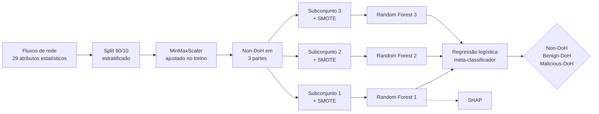
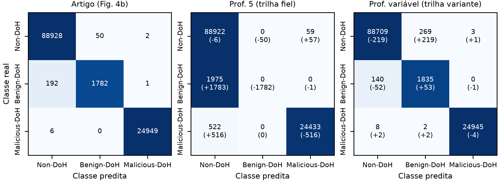
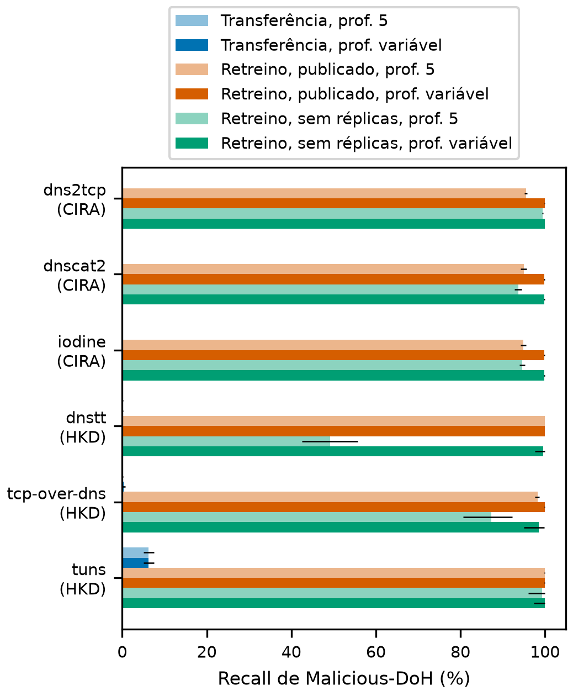

<div align="center">

# IDS explicável para ataques DNS over HTTPS

**Reprodução, avaliação em um segundo conjunto de dados e extensão de um sistema de detecção de intrusão para túneis DNS sobre HTTPS.**

[](https://github.com/BrenoRev/Tecnicas_Ataque_Deteccao_Intrusao/actions/workflows/ci.yml)


[Relatório (PDF)](entregaveis-apresentacao/relatorio.pdf) · [Apresentação (PPTX)](entregaveis-apresentacao/apresentacao.pptx) · [Roteiro da fala](entregaveis-apresentacao/roteiro.md) · [Guia técnico](project/README.md) · [Resultados](project/results/)

</div>

Projeto da disciplina **CIN0114, Técnicas de Ataque e Detecção de Intrusão** (CIn/UFPE, 2026.2), do Prof. Paulo Freitas de Araujo Filho. O artigo reproduzido:

> T. Zebin, S. Rezvy and Y. Luo, "An Explainable AI-Based Intrusion Detection System for DNS Over HTTPS (DoH) Attacks," *IEEE Trans. Inf. Forensics Security*, vol. 17, pp. 2339-2349, 2022, doi: [10.1109/TIFS.2022.3183390](https://doi.org/10.1109/TIFS.2022.3183390).

## Em uma frase

Reimplementamos o sistema a partir do texto do artigo, porque o repositório dos autores não contém o modelo, medimos tudo em dez seeds e mostramos que o detector aprende um artefato da captura dos dados: treinado no conjunto original, ele deixa passar 98% dos túneis de três ferramentas que não viu.

## O que foi feito

| Objetivo | Entrega | Onde ver |
| --- | --- | --- |
| **1. Reproduzir o artigo** | Todas as tabelas e figuras de resultado: Tabela I, Fig. 2, Fig. 4, Tabela II, Figs. 5 a 8, Seção VI-D e Fig. 9 | [`results/e0`](project/results/e0/dados/RESUMO.md) a [`e7`](project/results/e7/RESUMO.md) |
| **2. Outro conjunto de dados** | Tudo de novo no DoH-Tunnel-Traffic-HKD e no combinado CIRA + HKD | [`results/e6`](project/results/e6/RESUMO.md) |
| **3. Melhorar o sistema** | Random Forest único com peso de classe, comparado em dez seeds, e teste de robustez | [`results/e8`](project/results/e8/corrigida/RESUMO.md) |

## O sistema do artigo



## Resultados

O artigo traz duas passagens sobre a profundidade das árvores: profundidade máxima 5 (Seção IV-B) e "variable tree depth" (Algoritmo 1). Medimos as duas, no mesmo protocolo.

| | Artigo | Profundidade 5 | Profundidade variável |
| --- | --- | --- | --- |
| Acurácia no teste (Fig. 4b) | 99,78% | 97,79% | **99,64%** |
| Recall de Benign-DoH | 90,23% | 0,00% | 92,91% |
| Recall de Malicious-DoH | 99,98% | 97,91% | 99,96% |
| F1 macro em 10 seeds | não informado | 65,67% ± 0,14 | 96,56% ± 0,12 |

<p align="center">
  
</p>

**Segundo conjunto de dados.** O modelo treinado no conjunto original detecta 1,81% dos túneis do HKD. Retreinado com eles, chega a 99,42%, mas em fluxos muito próximos dos do treino.

<p align="center">
  
</p>

**O que explica a queda.** Uma regra com quatro valores de um único atributo, `PacketLengthMode`, tem recall de 99,84% no conjunto original, com 1 falso positivo em 909.555 fluxos, e 0% no HKD. O tráfego malicioso do conjunto original foi capturado em outras máquinas e em outro período.

**Modificação da equipe.** Um Random Forest único, sem SMOTE e com peso de classe, ganha cerca de 0,5 ponto de F1 macro sobre o sistema do artigo nas dez seeds, nos dois conjuntos. A seleção de hiperparâmetros não acrescenta F1 sobre essa troca e custa mais tempo de treino.

Os números completos, com o que cada um permite e não permite concluir, estão no [relatório](project/report/relatorio.pdf) e nos arquivos `RESUMO.md` de cada experimento.

## Como rodar

```bash
git clone https://github.com/BrenoRev/Tecnicas_Ataque_Deteccao_Intrusao.git
cd Tecnicas_Ataque_Deteccao_Intrusao
git config core.hooksPath .githooks        # hooks de commit, uma vez por clone

cd project
uv sync --locked                           # ambiente com versões fixadas
uv run pytest                              # 113 testes, dados sintéticos, cerca de 1 min
```

Para reproduzir os experimentos, baixe os dados (zip de 1,5 GB, [instruções](project/README.md#dados)) e siga a [ordem dos 22 passos](project/README.md#como-rodar). A execução completa leva cerca de 9 horas em uma máquina de 10 núcleos.

```bash
uv run python data/verify.py               # confere os hashes dos dados
uv run python scripts/e0_dados.py          # limpeza e Tabela I, menos de 1 min
uv run python scripts/e1_reproducao.py     # reprodução do artigo, cerca de 1 h
bash scripts/execucao_limpa.sh logs/       # todos os passos, em ordem
```

## Estrutura

```
.
├── project/                  código, testes, resultados e relatório
│   ├── src/doh_ids/          pacote: dados, splits, modelos, avaliação, SHAP
│   ├── scripts/              um script por experimento (E0 a E8) e por resumo
│   ├── tests/                113 testes com dados sintéticos
│   ├── results/              métricas e resumo de cada execução, com o commit que a gerou
│   └── report/               relatório, apresentação, tabelas e figuras
├── docs/                     estudo do artigo, dos dados e da disciplina
├── planejamento/             plano de implementação e decisões da equipe
├── entregaveis-apresentacao/ cópia final do relatório, da apresentação e do roteiro
├── geracao_latex_and_pdf/    modelos do relatório e dos slides
└── .github/, .githooks/      integração contínua e hooks de commit
```

## Reprodutibilidade

- **Ambiente fixado:** Python 3.12, dependências com versão exata no `uv.lock`.
- **Rastro de cada número:** todo resultado tem um `run.json` com seed, versões, hash dos dados e o commit do código, gerado com a árvore do Git limpa.
- **Determinismo:** duas execuções produzem `metrics.json` idênticos.
- **Sem vazamento:** o teste é separado antes de qualquer ajuste; normalização e reamostragem só veem o treino. Há testes para cada invariante.
- **Dados fora do Git:** os conjuntos ficam em um arquivo externo, conferido por hash.

## Limitações

- O tráfego malicioso do conjunto original vem de outras máquinas e de outro período: nenhum split dentro dele separa "ataque" de "captura".
- 13,67% do teste tem vetor de atributos idêntico a um do treino.
- O segundo conjunto reusa o tráfego legítimo do primeiro; só a classe maliciosa é nova.
- O teste de robustez perturba atributos, não gera tráfego: é um limite aproximado, não uma taxa de evasão.

## Equipe

| Integrante | Login |
| --- | --- |
| Amanda Arruda | aams2 |
| Antonio Gonzaga | agla |
| Breno Silva Xavier de Souza | bsxs |
| João Henrique Portela | jhpbs |

## Licença e citação

O código é distribuído sob a [licença MIT](LICENSE). Ela não cobre o artigo reproduzido, os conjuntos de dados nem o material da disciplina, que pertencem aos respectivos autores. Ao usar este trabalho, cite o artigo original e os conjuntos de dados, indicados no [guia técnico](project/README.md).
